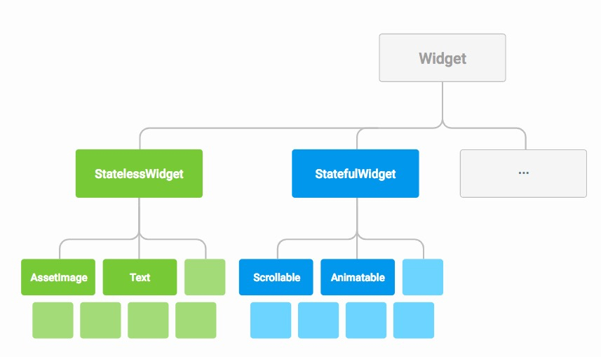
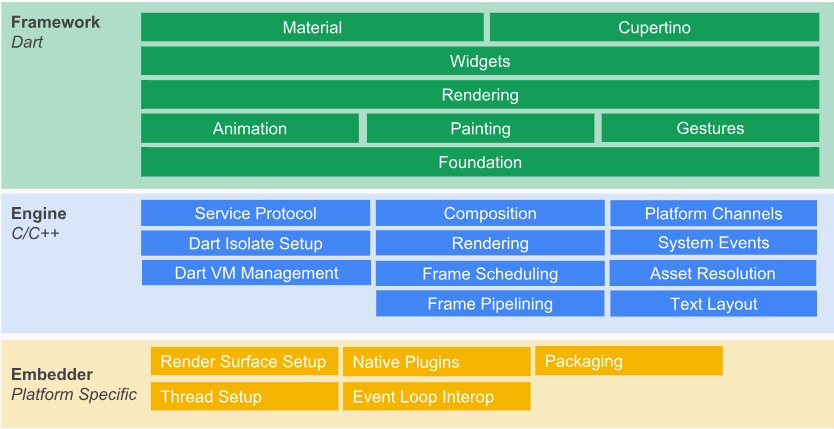
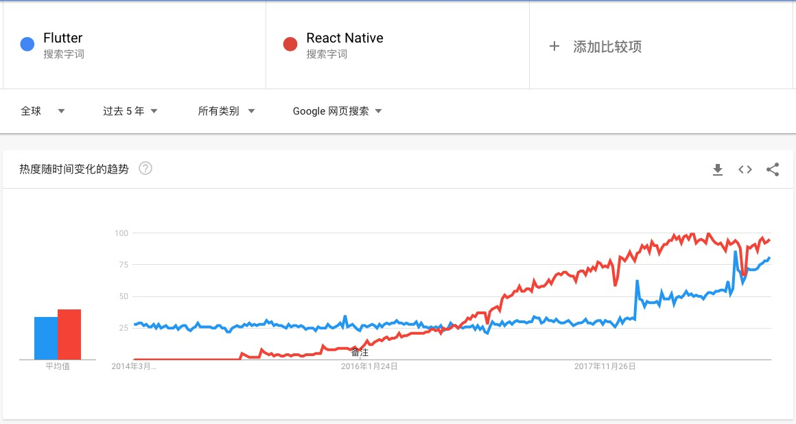
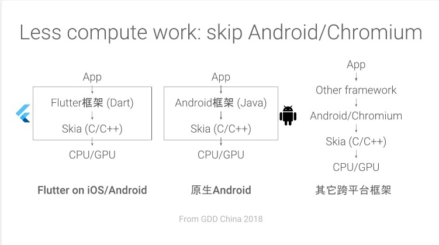

# 简介

Flutter 是 Google 用以帮助开发者在 iOS 和 Android 两个平台开发高质量原生 UI 的移动 SDK。只需要维护一套代码就能在ios和Android中构建漂亮的App应用，并且性能不逊色于原生应用。这篇文章主要是通过走马观花的方式快速预览Flutter。

## 整体框架

Flutter包括一个现代的响应式框架，一个2D渲染引擎、现成的widget和开发工具。这些组件可以帮助您快速地设计、构建、测试和调试应用程序。

## Flutter Widget

Flutter Widget一个现代响应式框架，主要从React中获取的灵感，中心思想是用Widget构建UI。Weiget描述了他们的视图。当widget的状态发送变化的时候，widget会重绘UI，Flutter会对比前后变化的不同，以确定底层渲染树从一个状态转换到下一个状态所需的最小更改，类似于React中虚拟DOM的diff算法。总之Widget描述了Flutter的布局和交互方式。

我们可以用简单的"Hello,world"大体对比下Flutter和React的代码。

```dart
class MyApp extends StatelessWidget {
  @override
  Widget build(BuildContext context) {
    return Center(
      child: Text(
        'Hello, world!',
        textDirection: TextDirection.ltr,
      ),
    );
  }
}
```
我们翻译成React就像下面这样

```js
class MyApp extends Component {
  render() {
    return (
      <Center>
        <Text textDirection={TextDirection.ltr}>Hello, world!</Text>
      </Center>
    )
  }
}
```

Flutter和React非常相似，只是把React的JSX变成了一个纯对象，把`Component`变成`StatelessWidget`。个人认为JSX的描述方式比较直观，第一是习惯问题，第二是用对象形式如果层层嵌套末尾都用“)”，很难辨认出对应的代码段是哪个控件，当然现在IDE都会在末尾自动注释来解决这些问题。所以习惯因素是主导我觉得JSX比较好看的原因。

这里一个知识点`StatelessWidget`是有无状态组件，还有个有状态组件`StatefulWidget`，可以通过`setState()`来改变状态。熟悉React的同学是不是非常熟悉，这些内容后面会再讲到。

总体上就是通过Widget来组合，像搭积木一样描述界面。

## 使用语言Dart

对的，Flutter既不是用`JS/TS`或者是`Java`这类的主流语言，而是用`Dart`。说道`Dart`其实很容易就会想到`Typescript`，他们其实都是altjs语言。Typescript目标是做到兼容JS，是一个严格的超集。而Dart是完全推翻Javascript，采取替代的策略，重新制造一门语言。当然无论对于熟悉js或java的同学都很容易上手。网上有个网友写的[《为`JavaScript`开发人员准备的`Dart`参考教程》](https://github.com/icepy/flutter-book/blob/master/doc/basics/u_t_javascript.md)，可以快速的参考上手。

## Flutter分层框架预览

Flutter 整体架构主要分三层：Framework，Engine 与 Embedder。



1. `Framework`层，平常开发都在这层，Material和Cupertino是最最上层的设计框架，一个是Android的一个ios的，类似antD，只是一种UI设计框架，用户自己选一个就好。`Widgets`上面提到的，这个是整个Flutter最重要的组件。然后就是渲染、动画、手势等。

2. `Engine`是由C/C++写的渲染引擎，包含`Skia`，`Dart`和`Text`，这里着重说下Skia渲染引擎，Skia是一个开源的二维图形库，提供各种常用的API，并可在多种软硬件平台上运行。谷歌Chrome浏览器、Chrome OS、安卓、火狐浏览器、火狐操作系统以及其它许多产品都使用它作为图形引擎，也支持Windows 7+，macOS 10.10.5+，iOS8+，Android4.1+，Ubuntu14.04+ 等平台。

3. `Embedder`是一个嵌入层，即把Flutter嵌入到各个平台上去，这里做的主要工作包括渲染Surface设置，线程设置，以及插件等。从这里可以看出，Flutter的平台相关层很低，平台(android，iOS)只是提供一个画布，剩余的所有渲染相关的逻辑都在Flutter内部，这就使得它具有了很好的跨端一致性。但是这就导致一些问题，比如地图这种插件就需要额外的造轮子，而不能使用现有原生的插件。但是我觉得跨端一致性才是款平台最重要的理念，这方面生态上去必然会克服的。

## 对比React Native

`Flutter`直接竞争对手肯定是`React Native`，两者都是非常优秀的跨平台移动应用框架。

先看下React Native和Flutter近5年的Google搜索热度比较。



可以看出React Native在2016年就开始稳健的上升，而Flutter是在2018年2月份的时候才开始有上升趋势。现在Flutter依然是比React Native热度低，但是非常接近了。虽然只是一个搜索的热度图，但是可以侧面的说明了，React Native因为比较早，成熟度比Flutter高，而Flutter到2018年才开始慢慢变热门。

### 性能

React Native是通过Javascript在Chromium解释运行然后调用原生组件渲染，Flutter通过`Dart`直接`AOT`编译为本地代码，去控制`Skia`2d渲染引擎。所以从理论上来说，因为React Native多了一层Bridge解释沟通，而Flutter是直接AOT编译运行本地代码，并直接由Skia接管，速度是会优于React Native的。

如下图(from What makes Flutter fast, Yuqian Li on D2)，可以看到Flutter调用和Android原生调用是一模一样的，直接由framework层调用到Skia，而ReactNative有个中间层去调度。



### 跨端一致性和保留原生

Flutter因为Skia，低层就是一个受控的画布，Flutter可以让你控制屏幕上的每一个像素，可以让你轻松生成动画图形、视频、文本和控件，是真的可以达到跨端一致性。而React Native是用Javascript控制原生控件，坏处是要根据不同端差异性进行妥协，好处是保留了原生能力，就是原来原生的一套现在都可以用。跨端一致性和保留原生在一定程度上是一个矛盾体，就看个人如何衡量利弊了。但是我个人认为跨端一致性才是真的款平台所需要的样子。

### 稳定性和生态圈

React Native现在已经相对成熟了，目前许多坑比如拍照，地图，视频，通知......等等都得到了良好解决，但是Flutter还在这些填坑的路上，东西都有，但是能保证没坑是不可能的。所以现阶段除非新产品尝鲜，不怕填坑，如果要稳定的输出成熟的产品我还是推荐React Native的。

因为Flutter选择Dart，生态圈远比React Native小很多。毕竟React Native发展多年，又背靠Javascript、React、原生Native，这些是Flutter远远赶不上的。

### 开发上手

首先无论是Flutter还是React Native都需要Native开发相关的知识。但是Flutter毕竟要多学习一门新的语言Dart，虽然Dart很容易上手，但是好上手并不等于能弥补对这门语言的理解和坑，这些都需要经验来填充的。所以上手难度还是比React Native高一些

总之我看重Flutter，不是因为他上层的Weiget框架和Dart语言，而是因为Flutter Engine底层渲染引擎，就算只看UI层，他抹平了平台的差异，实现正的跨平台一致性。但是如果把Weiget和Dart换成React和Typescript我会更加支持Flutter，这样才是真的减少我们程序员的学习成本。毕竟同一套理念，换了一套标准去实现，是非常难受的一件事。当然Flutter因为整个跨平台框架的设计理念，还是非常靠谱的跨平台框架。
