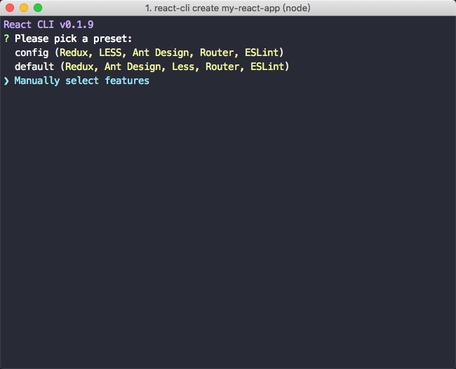
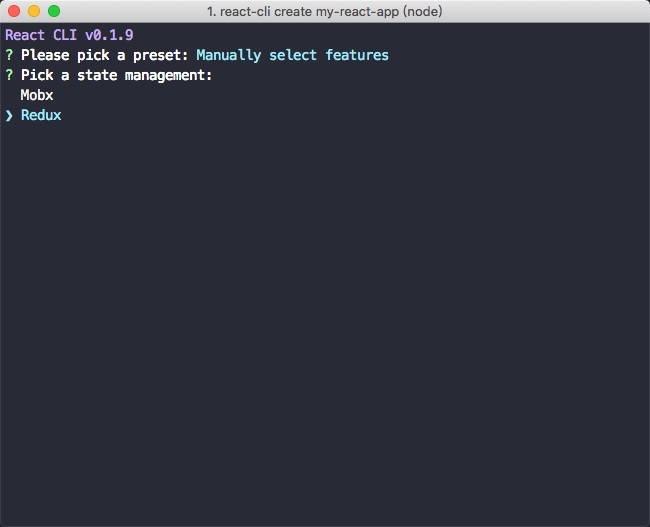
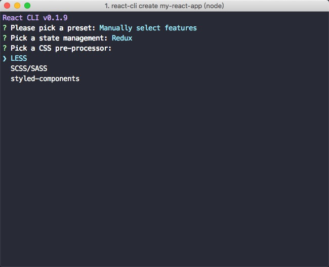

# 前言

`create-react-app`作为facebook官方的react脚手架是相当好用的。主要设计原理是将配置好的如`Webpack，Babel，ESLint`，合并到`react-scripts`这npm包中，用户就可以开箱即用。很多开发者都在这基础上进行改造开发。注意`react-scripts`就是create-react-app脚手架的核心配置代码。

目前如果要自己定制配置，有两种方案可选。一个是`eject`，他的原理是将`react-scripts`拆除然后将配置暴露到应用顶层，用户就可以自行进行配置。另一个是使用`react-app-rewired`，用户通过`config-overrides.js`增加修改配置。两者各有好处。`eject`直接暴露可以自行配置，但是坏处就是`react-scripts`被解散了，就不能随官方配置进行升级。`react-scripts`包揽了那些最基础配置的脏活累活，并且一直再维护，比如修复BUG和打包优化，运行速度优化。前端发展的迅速，这些基础配置随着基础设施的升级，可能随时都会变化。我觉得`eject`后要就需要承担维护成本的风险。我的理念是将专业的事情交给专业的人去做就好了，我们应该享受金字塔底层带来的基础设施便利去创造价值，没必要重复造轮子，更没必要在轮子上耗费过多的维护成本。

我的理念是推荐使用`config-overrides.js`来定制配置，降低维护成本。也就是在`react-scripts`的配置上进行增删改查，不影响底层配置代码，在未来需要的时候还可以进行无缝升级`react-scripts`，来提升速度或者解决你未关注到的BUG等等。但是`create-react-app`只是提供最最基础的设施建设，我们最常用的框架配置都需要自己去定制，每次创建项目的时候都需要再写一次定制代码，相当烦人。所以才有了今天的主题基于create-react-app的脚手架，确切说应该是基于`react-scripts`的脚手架。

所以这篇文章主题应该有两个

- 怎么制作CLI工具
- 怎么根据`react-scripts`来写脚手架

项目核心代码在github上：(https://github.com/LinYouYuan/react-cli)，这个链接上面也有使用帮助说明，可以先点击进去看，可以更好的理解使用和需求。

## 项目核心需求

我们需求是：

1. 保证基础依赖和官方同步；
2. 创建时增加常用框架选择;
3. 创建项目后配置项可定制;

第一点，我们需要引入`react-scripts`和`react-app-rewired`，来保持官方同步和可定制型。

第二点，我整理出我们常用的框架可选项：

类型 | 可选框架名称
:- | :- 
语言 | JavaScript / TypeScript
状态管理库 | Redux / Mobx
css预处理器 | SCSS / LESS / styled-components
UI组件 | Antd / Ant-mobile
代码规范 | Airbnb
HTTP库 | Axios
路由 | react-router

第三点，创项目后我们可以通过`config-overrides.js`文件来预先配置，然后用户可以再此文件进行继续配置和改造。

## 制作CLI工具

### 引入常用工具包

首先创建nodejs项目。制作常用的Cli工具，我们一般都需要安装下面5个工具包：（执行`npm install`或者其他工具安装）

- commander: 用来接收输入命令参数，然后处理事件；
- execa: 用来执行操作命令，一个更好的`child_process`；
- inquirer: 这是创建cli最主要的工具，可以生成非常美观的命令行界面；
- chalk: 可以修改字体颜色；
- fs-extra: 比原生fs更好用的fs；

### 创建全局使用

我们首先要创建一个像`creact-react-app`一样直接在全局就可以执行使用的命令。

1. 我们在根目录下创建文件夹和文件`lib/index.js`，这个其实就是入口执行文件。其中`#!/usr/bin/env node`一定要填写。

`lib/index.js`

```js
#!/usr/bin/env node
console.log('hello world')
```

2. 然后在`package.json`中添加代码，如下，其中`react-cli`就是全局要使用的命令名称，`lib/index.js`就是上面要执行的文件地址。

`package.json`

```json
"bin": {
    "react-cli": "lib/index.js"
}
```

3. 执行`npm link`。执行完成后，我们就可以把命令挂载到全局，效果和`npm install -g`后一样，可以全局输入命令。link的主要目的是给我开发调试用的。现在可以直接在控制台输入`react-cli`执行，你就可以看到打印的`hello world`了。

4. 等开发完成，你可以试试发布到npm包上，但是我推荐等开发完成后再发布，当然不妨碍你好奇心想试试。发布前需要执行`npm login`，登录npm账号密码，注意你如果是淘宝源你需要通过`npm config set registry http://registry.npm.tongdun.cn`暂时切回官方源。然后执行`npm publish`发布，这个时候也要注意，你的`package.json`中的`name`也就是项目名称不要和别人重名了。发布好你就可以通过`npm i <you project name> -g`来全局安装你的包。

## 命令管理

在`lib/index.js`中，我们输入如下

```js
const program = require('commander');
const chalk = require("chalk");

program
  .version(require('../package').version)
  .usage('<command> [options]');

program
  .command('create <app-name>')
  .description('create a new project powered by react-cli')
  .action(name => {
    // 这里处理逻辑
    console.log(chalk.blue(`React CLI v${require('../package').version}`));
    // const create = require('./cli/create');
    // create(name);
  });
```

这里主要通过`commander`来配置接受不同命令处理。这里主要就是要接受`create <app-name>`参数，然后处理输入命令后的逻辑。其中`chalk`就是颜色处理。

然后继续处理未输入和输入错时候弹出帮助如下

```js
program
  .arguments('<command>')
  .action((cmd) => {
    program.outputHelp()
    console.log(`  ` + chalk.red(`Unknown command ${chalk.yellow(cmd)}.`))
    console.log()
  })

program.parse(process.argv);

if (!program.args.length) {
  program.outputHelp();
}
```

## 交互界面

接收到用户输入的命令后，我们就要呈现交互界面，这个时候我们就用到了非常好用的工具`inquirer`。具体可以实现多少种交互形式可以点[inquirer的npm网站](https://www.npmjs.com/package/inquirer)的介绍看。我这里主要用了`list`和`confirm`的功能，也就是列表选择和寻问功能。比如让用户选择使用什么框架：

```js
function selectManually(appName) {
  inquirer
    .prompt([
      {
        type: 'list',
        name: 'language',
        message: 'pick a language:',
        choices: [
          'JavaScript',
          'TypeScript',
        ]
      },
      {
        type: 'list',
        name: 'stateManagement',
        message: 'Pick a state management:',
        choices: [
          'Mobx',
          'Redux',
        ]
      },
      {
        type: 'list',
        name: 'cssPre',
        message: 'Pick a CSS pre-processor:',
        choices: [
          'LESS',
          'SCSS/SASS',
          'styled-components',
        ]
      },
      {
        type: 'list',
        name: 'design',
        message: 'Pick a UI Design:',
        choices: [
          'Ant Design',
          'Ant Design Mobile',
        ]
      },
    ])
    .then(answers => {
      const creator = new Creator(appName, answers);
      creator.create();
    })
}
```
## 创建项目

新建一个Creator类，主要用来创建项目用的，初始化接受两个参数，一个是项目名称，一个是用户选择的框架。我项目中的模板存放在`lib/packages/common-default`中。这里我主要针对各种不同的配置，来修改`packages.json`、`babelrc`、`config-overrides.js`文件的内容就好了，然后执行复制操作。

```js
const chalk = require("chalk");

const fs = require("fs-extra");

const path = require("path");

const inquirer = module.require('inquirer');

const {
  getPackageJson,
  writeJsonToApp,
  copyFiles,
  setNewPackageVersion,
  installPackge,
  setUserConfig,
} = require('../packages/common');

class Creator {
  constructor(appName, answers) {
    this.appName = appName;
    this.answers = answers;
    this.appDir = path.resolve(process.cwd(), this.appName);
    this.package = getPackageJson('cli-switch');
    this.babelrc = {
      plugins: [
        [
          "import",
          {
            libraryName: "antd",
            style: true,
          }
        ]
      ]
    }
  }

  async testExistDir() {
    if (fs.existsSync(this.appDir)) {
      const { override } = await inquirer.prompt([
        {
          type: "confirm",
          name: "override",
          message: chalk.red(`directory ${this.appName} exist,override it?`)
        }
      ]);
      if (override) {
        console.log(chalk.green("removing..."));
        fs.removeSync(this.appDir);
        return true;
      } else {
        process.exit(1);
        return false;
      }
    }
    return true;
  }

  async create() {
    const { stateManagement, cssPre, design } = this.answers;

    console.log();

    console.log(`you pick: ${chalk.yellow(`${stateManagement}, ${cssPre}, ${design}, Router, ESLint`)}`);

    console.log();

    const isOk = await this.testExistDir(this.appDir, this.appName);

    if (!isOk) {
      return;
    }

    console.log(`🚀  Invoking generators...`);

    console.log();

    let { dependencies, devDependencies } = this.package;

    switch (stateManagement) {
      case 'Mobx':
        dependencies['mobx'] = '';
        dependencies['mobx-react'] = '';
        break;
      case 'Redux':
        devDependencies['redux-devtools'] = '';
        dependencies['redux'] = '';
        dependencies['react-redux'] = '';
        break;
    }

    switch (design) {
      case 'Ant Design':
        let myTd = this.babelrc.plugins[0][1];
        myTd.libraryDirectory = 'es';
        dependencies['antd'] = '';
        break;
      case 'Ant Design Mobile':
        let myTdw = this.babelrc.plugins[0][1];
        myTdw.libraryName = 'antd-mobile';
        myTdw.style = 'css';
        dependencies['antd-mobile'] = '';
        break;
    }

    switch (cssPre) {
      case 'LESS':
        dependencies['less-loader'] = '';
        devDependencies['react-app-rewire-less-modules'] = '';
        break;
      case 'SCSS/SASS':
        dependencies['node-sass'] = '';
        break;
      case 'styled-components':
        dependencies['styled-components'] = '';
        devDependencies['babel-plugin-styled-components'] = '';
        this.babelrc.plugins.push("babel-plugin-styled-components");
        break;
    }

    fs.mkdirSync(this.appDir);

    this.beginCopy(cssPre === 'LESS');

    writeJsonToApp(this.appDir, '.babelrc', this.babelrc);

    console.log(`📦  Installing additional dependencies...`);

    installPackge(this.appDir);

    setUserConfig({ hasConfig: true, config: this.answers });

    console.log(`🎉  Successfully created project ${chalk.yellow(this.appName)}.`)

    process.exit(1);
  }

  async beginCopy(isLess = false) {
    setNewPackageVersion(this.package.dependencies);
    setNewPackageVersion(this.package.devDependencies);

    this.package.name = this.appName;

    copyFiles(path.join(__filename, '../../packages/common-default'), this.appDir);

    writeJsonToApp(this.appDir, 'package.json', this.package);

    if (!isLess) {
      fs.copySync(path.join(__filename, '../../packages/cli-switch/config-overrides.js'), this.appDir + '/config-overrides.js');
    }

  }
}

module.exports = Creator;
```

## 创建好项目后配置

创建好项目只要在`config-overrides.js`里配置Webpack devServer jest。可以在这里添加自定义的config配置来增加修改loader, plugin, optimization进行配置。`webpackMerge`使用混入的方式去添加config。

`config-overrides.js`

```js
const path = require('path');
const webpackMerge = require('@/webpack-merge');

const appSrc = path.join(__dirname, 'src');

SKIP_PREFLIGHT_CHECK = true

const {
  override, addLessLoader, addWebpackAlias, useBabelRc, addDecoratorsLegacy,
} = require('@/customize-cra');

//打包分析
const BundleAnalyzerPlugin = require('@/webpack-bundle-analyzer').BundleAnalyzerPlugin;

// 这里可以直接修改 Host 或者 Port
// process.env.HOST = 'localhost.xxxx.com';
// process.env.PORT = 3006;

// 生产环境是否打包 Source Map
process.env.GENERATE_SOURCEMAP = false;

module.exports = {
  // 配置devServer
  devServer: configFunction => (proxy, allowedHost) => {
    proxy = {
      '/mock': {
        // 这里配置代理服务地址
        target: 'http://localhost:3000',
        changeOrigin: true,
        pathRewrite: { '^/mock': '' },
      },
    }
    // allowedHost： 添加额外的地址
    const config = configFunction(proxy, allowedHost);
    return config;
  },

  // 配置webpack 
  webpack: (config, env) => {
    // 开发环境
    const isEnvDevelopment = env === 'development';
    // 生产环境
    const isEnvProduction = env === 'production';

    // 通过customize-cra插件覆盖
    config = override(
      // 配置路径别名
      addWebpackAlias({ '@': appSrc }),
      // 对Decorators支持
      addDecoratorsLegacy(),
      useBabelRc(),
    )(config, env);

    return webpackMerge(config, {
      // 用户可以在这里添加自定义的config配置 来增加修改loader, plugin, optimization
      plugins: [
        // new BundleAnalyzerPlugin(),
      ],
      optimization: {
        splitChunks: {
          cacheGroups: {
            vendors: { // 基本框架
              chunks: 'all',
              test: /(react|react-dom|react-dom-router|babel-polyfill|mobx|antd)/,
              priority: 100,
              name: 'vendors',
            },
            asyncCommons: { // 其余异步加载包
              chunks: 'async',
              minChunks: 2,
              name: 'async-commons',
              priority: 90,
            },
            commons: { // 其余同步加载包
              chunks: 'all',
              minChunks: 2,
              name: 'commons',
              priority: 80,
            },
            // echartsVendor: { // 异步加载echarts包
            //   test: /echarts/,
            //   priority: 100, // 高于async-commons优先级
            //   name: 'echartsVendor',
            //   chunks: 'async'
            // },
          }
        },
      }
    })
  },

  // 配置测试
  jest: config => {
    config.moduleNameMapper = {
      // 同webpack一样配置别名
      '@/(.*)$': '<rootDir>/src/$1',
    }
    return config;
  },
}
```

## 使用简单演示

用户第一次创建有两个选项

- `default (JavaScript, Redux, Antd, Less, Router, ESLint)` 默认配置
- `Manually select features ` 选择配置

第二次创建的时候会多一个用户上次选择过的选项配置`config`，就像如下进行选择配置。






